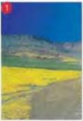
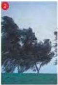
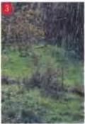
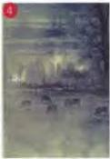
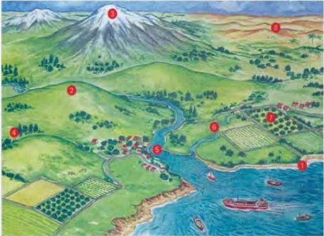

# The countryside

1.6

Here are some words to describe the weather.
Match them with the pictures in Workbook activity A.

A rainy weather

B a misty day

C a sunny afternoon

D a windy evening

Here are some names of things you can see in the countryside.
Match them with the pictures in Workbook activity A.

A a stream

B a mountain

C farmland

D a river

E a coastline

F a valley

G a desert

H a hill

Look at the pictures. Try to describe what you can see.
Now do activities B and C in the Workbook.

5

SOM