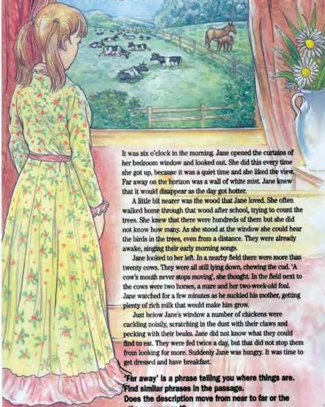

1.11

## A view from a window

Look at the four paragraphs. Decide what part of the view the girl is describing in each.

It was six o'clock in the morning. Jane opened the curtains of her bedroom window and looked out. She did this every time she got up, because it was a quiet time and she liked the view. Far away on the horizon was a wall of white mist. Jane knew that it would disappear as the day got hotter.

A little bit nearer was the wood that Jane loved. She often walked home through that wood after school, trying to count the trees. She knew that there were hundreds of them but she did not know how many. As she stood at the window she could hear the birds in the trees, even from a distance. They were already awake, singing their early morning songs.

Jane looked to her left. In a nearby field there were more than twenty cows. They were all still lying down, chewing the cud. 'A cow's mouth never stops moving', she thought. In the field next to the cows were two horses, a mare and her two-week-old foal. Jane watched for a few minutes as he suckled his mother, getting plenty of rich milk that would make him grow.

Just below Jane's window a number of chickens were cackling noisily, scratching in the dust with their claws and pecking with their beaks. Jane did not know what they could find to eat. They were fed twice a day, but that did not stop them from looking for more. Suddenly Jane was hungry. It was time to get dressed and have breakfast.

**'Far away' is a phrase telling you where things are. Find similar phrases in the passage. Does the description move from near to far or the other way around?**

**Now do activities A and B in the Workbook.**

8