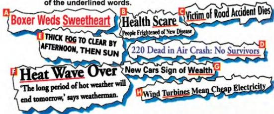

UNIT 2 REPORTING EVENTS

2.1

## Newspaper headlines

A newspaper headline says in a few words what the report below it is about. They generally use shortened, simplified sentences. For example, in English-language headlines, the verb to be, there is/are, and the articles a, an and the are usually left out. Also, they are often written in the simple present tense even when talking about the past or the future.

Look at the headlines below and try to work out the meaning of the underlined words.

Read how to work out the meaning of words. Then look at the underlined words again. Say which clue helped you understand them.

### Working out meanings

Remember to use these clues to help you work out the meanings of new works.

1 Synonyms - words with the same meaning
Example: The English lesson starts at 8:45; the History lesson commences at 9:45.
2 Antonyms - words with the opposite meaning
Example: Sue is always well dressed; Barry, however, always looks scruffy.
3 A definition or explanation
Example: Mona is a diligent, that is to say, a very hard-working pupil.
4 Examples or illustrations that show the meaning
Example: Tourists want to buy local artefacts, such as knives, pots and jewellery.
5 Cause and effect or result; if you understand the cause of something, you can work out the effect, and the other way around.
Example: Ali has had many accidents because he always drives recklessly.
6 Purpose - what something does
Example: I've just bought a telescope so that I can study the stars.
7 Word formation
Examples: - two known words make a new word: pain + killer = painkiller
- suffixes: hope + less = hopeless, dark + en = darken
- prefixes: un + well = unwell

Now do activities A and B in the Workbook.

9