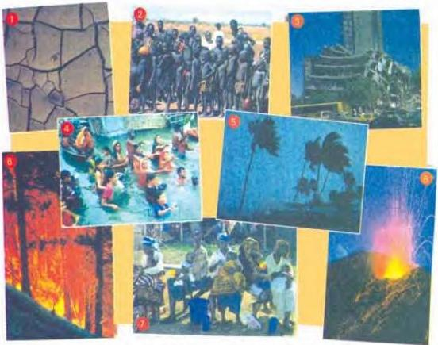

# Natural disasters

2.6

Here are some definitions of natural disasters. Match them with the pictures. Write your answers in Workbook activity A.

A very large wood is called a forest. A forest fire is very difficult to control because it spreads so quickly.
B A drought is a water shortage after a long period with no rain.
C When there is deep water over normally dry land, this is called a flood. When this happens very quickly, such as in a wadi in the mountains, it is called a flash flood.
D An epidemic is an illness that spreads quickly and affects many people.
E A volcano is a mountain with a hole in the top. Smoke rises out of the hole and liquid or molten rock flows. When the molten rock bursts out suddenly, this is called a volcanic eruption.
F A famine is a shortage of food. During a famine, people sometimes starve, they die of hunger.
G A hurricane is a powerful storm with strong winds.
H The hard rock surface of the earth is called the crust. The earth's crust is divided into several sections called plates. The place where two plates meet is called a fault line. Two plates moving along a fault line causes an earthquake. During an earthquake the ground moves and shakes.

Now do activities B and C in the Workbook.

13

A