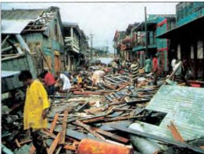

2.7

## A newspaper report

Read the headlines and look at the photograph in this newspaper report. What do you expect to read about?

# HURRICANE HITS CENTRAL AMERICA

## Thousands dead

The worst hurricane in living memory has caused terrible damage and loss of life throughout Central America. In the large towns, nearly three-quarters of all buildings have been destroyed. In the countryside, whole villages, in which hundreds of people lived, have disappeared. Hundreds of thousands are homeless and 10,000 are feared dead.

The storm hit the area late on Tuesday evening, destroying everything in its path. Winds of over 240 kph demolished all the wooden houses and tore the roofs off others, including the country's main hospital. Cars and lorries were blown onto their sides. Whole banana plantations, on which thousands of people worked, were flattened. Electricity and telephone lines were cut. In the mountain areas, heavy rain caused flash floods and

Houses flattened by 240 kph winds

landslides. Roads and bridges, along which all supplies used to come, were swept away. Rivers of mud, up to five metres deep, swept down the mountainsides, covering several villages.

On Wednesday afternoon the full extent of the damage became clear. Crowds of people stood around silently, looking at the wrecks of the houses they used to live in. Many had lost relatives, their

homes and their jobs. Men, women and children cried helplessly. Rescue teams started work as soon as they could, but they can do little for most of the people. There are no tents and few medical supplies. The only way to deliver them is by helicopter and the army only has two.

The hurricane is now moving towards the south coast of the USA, but is getting weaker all the time.

Look at the last sentence. Imagine you live on the south coast of the USA. Think of a headline for a newspaper report on the same day.

Now do activities A to E in the Workbook.

14

