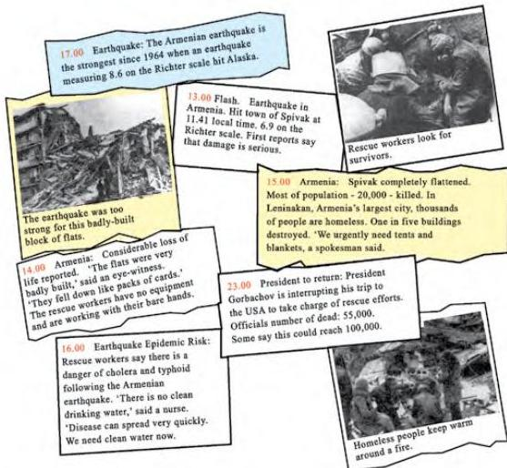

2.11

# Armenia - 7, December 1988

Look at the photographs and read the newsflashes and information about the disaster.

**The Richter scale:** The strength of an earthquake is measured on the Richter scale. It was invented by Charles Richter, an American scientist.

|  Richter scale | Effects  |
| --- | --- |
|  More than 8.0 | Almost total damage  |
|  More than 7.4 | Great damage  |
|  7.0 - 7.3 | Serious damage, metal bridges bent  |
|  6.2 - 6.9 | Considerable damage to buildings  |
|  5.5 - 6.1 | Slight damage to buildings  |

Think about the best order for the information.

Now do activities A, B and C in the Workbook before writing your own report.

16