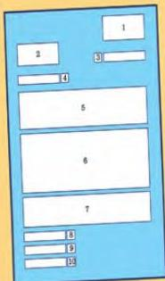

3.11 3.12

# A business letter

- A The sender's address
- B The name and address of the receiver
- C The sender's signature
- D The greeting, e.g. Dear Sir
- E The close, e.g. Yours faithfully
- F Information about the sender
- G A reference to the advertisement
- H The sender's name typed or printed
- I The date
- J Asking for an interview

This diagram shows the layout of a good formal letter. It is an application for a job that was advertised in a newspaper.

Match the boxes with the correct descriptions in the list below the letter. Write your answers in Workbook activity A.

Note: If you use the greeting Dear Sir, or Dear Madam, you must use Yours faithfully, to close.
If you use the greeting Dear Mr/Mrs Jones, for example, you must use Yours sincerely, to close.

Write a business letter in answer to this job advertisement in the Daily News of April 20th.

# Fantastic Job Opportunity!

Have you ever wanted to work on a newspaper?
We are looking for young men and women to train as reporters and photographers for a new general interest magazine for people under 25.

No experience is necessary but the successful applicants must be willing to work hard and already have a wide range of interests.

Write and tell us all about yourself and why you think we should give you the chance to join our exciting team.

Write to: The Editor, The Daily News, PO Box 0055, London S18 9HP

Now do activity B in the Workbook.

When writing a letter of application, you must sell yourself, that is, you must give as much interesting information about yourself as you can.

Answer these questions:

- Which school subjects do you like most? Why?
- What interests or hobbies do you have? Give details. If you like music, say which music and why; if you play sport, say which sport and why.
- Have you ever had any work experience? What was it?
- Have you done anything connected with the job itself? What was it?

- Have you travelled? Where to, when and why?
- Do you have any ambitions? What are they?

Remember!

- Lay out your letter correctly.
- Refer to the advertisement.
- Ask for an interview.
- Keep the letter short, but do not miss out anything important.
- Use the correct form of address.

24