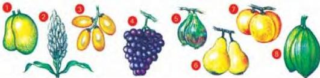
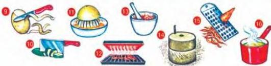

UNIT 4 TABLES, FLOW CHARTS AND DIAGRAMS

# Food

4.1

Here are some words connected with food and its preparation.
Match them with the pictures in Workbook activity A.

Things grown in Yemen

A dates B figs C mangoes D papayas E sorghum F apricots G grapes H pears

Answer these questions:

1 What grows in the mountains?
2 What grows on trees?
3 What is a grain crop?

Things we do when we prepare and cook food

I boil J squeeze K peel L crush M grate N chop O grill P grind

Answer these questions:

1 Can you peel a fig?
2 Can you grind sorghum?
3 What do you get if you squeeze a lemon?
4 In what ways do you generally:
- prepare vegetables?
- turn fruit into a drink?

Now do activity B in the Workbook.

25