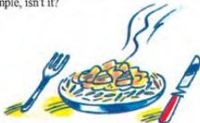

4.3

## Learning to cook

James is interested in learning to cook. His mother teaches him how to make a fish curry.

**Listen to the conversation. Answer the questions in Workbook activity A. Listen and repeat the conversation.**

Ask about it

Name ingu

Ask about it

Describe me

**James:** What are you doing, mum?  
 **Mother:** I'm making a fish curry.  
 **James:** That sounds good. And these are the ingredients?  
 **Mother:** Yes, I always prepare them before I start cooking.  
 **James:** So... that's the fish ... and the tomatoes and onions ... and that's garlic, isn't it?  
 **Mother:** Yes. Two peeled and chopped tomatoes, two chopped onions, and three crushed cloves of garlic.  
 **James:** What's that round, brown thing?  
 **Mother:** It's a *loomi* - a small, dried lime.  
 **James:** And those other things... they're spices, I suppose.  
 **Mother:** Yes, two teaspoons of *baharat* - that's a mixture of spices. And ... half a teaspoon of turmeric, half a teaspoon of chilli powder and a quarter of a teaspoon of ground ginger.  
 **James:** What's in this bowl?  
 **Mother:** Lemon juice... about one teaspoon.  
 **James:** Anything else?  
 **Mother:** Oil for frying, and, of course, salt and pepper.  
 **James:** So those are the ingredients. How do you actually cook the curry, then?  
 **Mother:** First you fry the onions and garlic. Then you add the spices and fry for a further two minutes. Next you add the tomatoes, *loomi*, lemon juice, salt and pepper. After that, you cover the mixture with water and simmer for fifteen minutes.  
 **James:** What about the fish?  
 **Mother:** While the mixture is boiling gently, you fry the pieces of fish.  
 **James:** How long for?  
 **Mother:** Until they are golden brown. Then you put the fish into the sauce and simmer for a further fifteen minutes... and that's it... fish curry. Simple, isn't it?

**Now do activities B and C in the Workbook.**

26