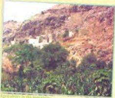

# Agriculture in Yemen

Information presented in a written passage can sometimes be shortened and presented in the form of a table. It is easier and quicker to find information using a table.

Scan these five paragraphs about agriculture in Northern Yemen. What type of information is in each paragraph? Would the information be easier to understand in table form?

The climate in the Northern part of Yemen can be divided into five areas or zones. In the Tihamah on the Red Sea (sea level to 300m) the climate is tropical. The air is hot and humid in the summer and pleasantly warm in the winter. Dates and cotton grow well here, as do vegetables and grains, which are both a winter and summer crop.

Further up the Western mountain slopes, in Zone 2 (300 - 2,200m), the climate becomes subtropical, then moderate. Fruit typical of this area are mangoes, papayas and bananas. The highest parts of the slopes have a moderate climate with rather cold winter nights. It is here that Yemen's most famous crop, coffee, is grown.

The Central Highlands (2,200-3,700m) also have a moderate climate. All kinds of grain crops, such as sorghum, are grown on the mountain terraces. Many types of fruit are found here, including apricots, peaches and figs. In the more protected wadi beds, where there is also more water, apples, pears, oranges, lemons and grapes are grown. Yemen has more than twenty different types of grape, some seedless, each of a different colour.

On the Eastern mountain slopes (2,300 -1,100m), the climate again becomes subtropical. There is much less rainfall than in the Highlands and farming takes place mostly in the wadis. In these wadis, which lead to the desert, grapes and some fruit trees can be found. In the lower areas close to the Ruba' Al Khali, there are date and palm trees.

Further east in the yellow sands of the desert (1,000m), very little grows. For a short time after the rains, a little grass may appear. Apart from this and a few shrubs, there is no other vegetation.

Read this text again carefully and transfer the information to the table in Workbook activity A.

Now do activities B and C in the Workbook.

27