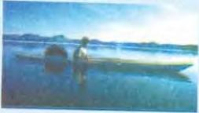
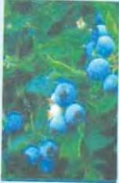
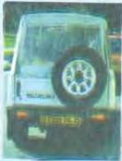

# Words and more words

4.7

Read this extract from a reference book about the English language and do Workbook activity A.

New words are coming into the English language almost every day. Where do these new words come from?

One way of creating new words to borrow or take them from other languages. English has been taking words from Latin, Greek and French for hundreds of years. French, for example, has given us some very common words, such as table, dinner and medicine. But English has borrowed from many other languages also; the list is endless.

Kayak, a kind of boat, and igloo, a house made of snow, come directly from the Eskimo language because these two objects are found only among the Eskimos, who live in the icy cold of the Arctic. Many years ago contact or meetings with Arab mathematicians brought the Arabic words algebra and zero into English. Trade with the Arab world has given English words like sugar, cotton and coffee.

Another way of forming new words is to add a prefix or suffix to the stem of a word that already exists. The stem of a word is the part that is common to all forms of that word, such as walk, walk (ing), walk(ed). A prefix is a group of letters that goes in front of the stem. Some common examples of prefixes are re-(remake), un-(unhappy) and mis-(misunderstand). A suffix is added to the end of a word. Examples are -able (comfortable) and -less (careless). A prefix usually changes the meaning of a word. A suffix usually changes the word into a different part of speech.

A third way of making new words is to combine or join together two different words to make another word. The words blue and berry can be combined to get the word blueberry. There are many berries that are blue in colour, but there is only one berry that is known as a blueberry. Other examples of words joined together are farmhouse,

handbag and newspaper. Sometimes the combined word, which is called a compound, has a hyphen in it, as in air-conditioner. Sometimes it is written as two words, as in seat belt, cassette recorder and word processor.

A fourth method of creating new words is to change the way a word is used. For example, a noun can be used as a verb, so that as well as buying some milk (noun) we can milk (verb) a cow. Other parts of speech can also be converted or changed. For example,

an adjective can be used as a noun, as when a spare wheel is called a spare. Prepositions are sometimes used as verbs, as in to up the price which, of course, means to raise or increase the price.

Now do activities B to F in the Workbook.

29

M