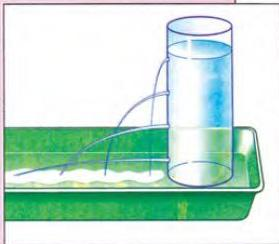

4.8

## Investigating the world around us

Aisha Yousif was asked to design a simple experiment on water pressure. She carried out an experiment in the school laboratory and wrote up her results.

**Read through the experiment. What did Aisha want to prove? Did she succeed?**

**Name:** Aisha Yousif

**Date:** 11.12.1999

**TITLE:** An investigation into water pressure.

**QUESTION:** Why is a dam thicker at the bottom than at the top?

**RESEARCH:** When you dive under water, the further you go down, the more your ears hurt.

**HYPOTHESIS:** The deeper the water, the greater the pressure.

**MATERIALS:** One 2-litre plastic bottle, a tray or basin, a nail, water and pair of scissors.

1. Cut the top off the plastic bottle.
2. Use a nail to make four holes in the bottle at different levels from top to bottom.
3. Put the bottle in the tray or basin.
4. Cover the holes with your fingers, and then have a friend fill the bottle with water.
5. When the bottle is full, take your fingers away from the holes and study the flow of water.

**DATA:** Four jets of water came out of the bottle. The jet at the top was the shortest and the jet at the bottom was the longest. The other two jets were in-between.

**CONCLUSION:** The length of the jet is related to the pressure of the water - the greater the pressure, the longer the jet. The longest jet is at the greatest depth. The data therefore confirms the hypothesis.

Now do activities A and B in the Workbook.

30