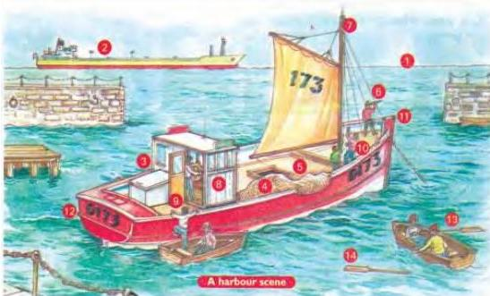

UNIT 5 WORKING THINGS OUT

5.1

## Word sets

Look at these words. What do they have in common?

table sofa chair armchair

Answer: They are all pieces of furniture.

A group of connected words is called a **word set**. The name of this set is *furniture*. Learning words as a set is one way of helping you remember them. The picture on this page illustrates words connected with travelling by sea.

In Workbook activity A, match the words below with the numbers in the pictures.

mast pulling up the sail rowing deck cabin horizon climbing aboard bow
oar telescope fishing boat tanker stern net

Look at the sentences below. Mark them true or false in Workbook activity B.

- A There is a large tanker on the horizon.
- B There is one sailor in the cabin.
- C The fishing boat has three masts.
- D There are some fish on the deck.
- E Some sailors are pulling up the flag.
- F Some sailor with the telescope is standing in the stern of the boat.
- G Three sailors are climbing aboard the fishing boat.
- H One man has lost an oar.
- I Some people are rowing away from the fishing boat.

Now do activities C and D in the Workbook.

33