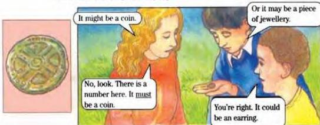
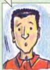
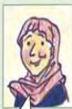
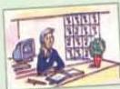
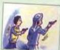
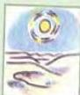
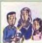
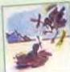
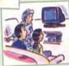
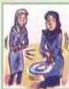

5.2

# Possibilities

Three children are looking at something that they have found.
They are trying to work out what it is.

Look at what they are saying.

Talk about what these objects might be.

Discuss the possibilities.

What would happen if ...

1 ... there was no more rain in Yemen?
2 ... all planes stopped flying?
3 ... all plants stopped growing?
4 ... there was no more electricity?

I've no idea.
I haven't a clue.

If there was no more rain in
Yemen, the whole country
would turn to desert.

34

Now do activities A, B and C in the Workbook.