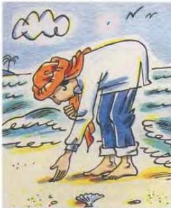
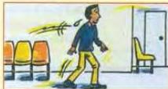

# Puzzles and riddles

5.4

Understanding some reading tests is like solving a puzzle. Things are not always stated or described directly. The reader has to infer what the writer is talking about.

**Read the puzzles below and work out what the answers might be. Activities A, B and C in the Workbook will help you think.**

**A More than one possible answer:**

*What is it?*

1 His day's work was over. He sat down and looked at the object on the table. He smiled, picked it up and put it to his mouth.
2 He was walking along the beach when suddenly he saw it lying on the sand. He went over and had a good look at it. 'I can use this,' he said to himself. He picked it up carefully and took it home.

Where are they?

1 He turned to the man in the seat next to him. 'What time do we leave?' he asked. 'Any minute now,' was the reply. Just then he heard the engine start. 'You're right,' he said.
2 I'm in a large room. People are talking quietly. Somebody comes into the room. Everybody stops chatting. The person starts speaking in a loud voice.

**B Only one possible answer.**

*Who says the following in their job?*

1 'As you can see, the inside of the building is decorated in the Chinese style.'
2 'I'm afraid we couldn't save the house because there wasn't enough water.'
3 'Can anybody tell me the name of the highest mountain in Africa?'
4 These peas will be ready for picking in about three days.
5 'How long do you wish to remain in the country, sir?'

*What objects might say something like this?*

1 'People kick me all the time but it doesn't worry me. It makes them happy, especially when they put me in the net.'
2 'People keep me in a safe place and use me when they want to buy things. I have a different name in most countries.'
3 'Without me you have to do your Mathematics homework in your head or on paper.'
4 'North, south, east or west - I'll show you where they are.'
5 'Hold me, jump off a mountain and fly like a bird.'

*What do these people feel? Why?*

1 He paced up and down the waiting room in the hospital.

2 She covered her face when she heard the news.

**Now do activity D in the Workbook.**

35