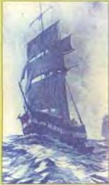

# The mystery of the Mary Celeste

What is the mystery? Read the article and find out.

from New York to Gibraltar. There was a good wind and visibility was excellent. The captain could see at least five kilometres in every direction. At about 9 o'clock one of the sailors sighted another ship on the horizon.

Two hours later the two ships were much closer to each other. Captain Morehouse put his telescope to his eye and looked at the other ship. There was something strange about the way she was moving. As the wind turned, the ship turned. The Captain ordered one of his crew to put up signal flags, greeting the other ship and asking for her destination. There was no answer. Some time later he looked through his telescope again. Now he could just make out the name of the ship: Mary Celeste. But then his blood ran cold. There was nobody on the deck of the ship, nobody climbing the masts and nobody at the wheel. The Mary Celeste was steering herself.

When the two ships were about 100 metres apart, Captain Morehouse and two of his crew rowed across to the Mary Celeste. He and one of the men climbed aboard. They went below

Sailors coming back from long voyages used to tell stories of lost cities, strange animals and boiling oceans. Most of these strange stories have been explained; others have stayed mysteries. The true story of the Mary Celeste is perhaps the most famous unexplained mystery of the sea.

On the morning of December 5th, 1872, Captain Morehouse, the Captain of the ship Dei Gratia, and his crew were sailing across the Atlantic Ocean

deck and looked in every cabin. They found nobody. The ship was completely deserted.

As they searched the mysterious ship, Captain Morehouse and the sailor became more and more puzzled by what they saw. In the crew's cabins, everything had been put away tidily, and in the kitchen, pans half-full of food were hanging over a dead fire. In the largest cabin, where the captain had lived with his family, there was a half-eaten meal on the table. On a sewing machine in one corner lay a child's dress, which somebody had been repairing. In a small cupboard Captain Morehouse found gold, jewellery and money. Nothing had been taken and there was no sign of panic or trouble. It seemed as if the crew and the passengers had decided at the same time to throw themselves into the sea.

Captain Morehouse and the sailor then found two unusual things. First they found a sword stained with what looked like blood. They thought the crew must have mutinied and killed the captain. However, all the ship's boats were still hanging in their correct places; the crew could not have left the ship that way. At the bow they found another mystery. Two pieces of wood, each about two metres long, had been cut out of the rail on both sides of the ship.

None of the people from the Mary Celeste was ever seen again. The strange story of the deserted ship found drifting on the open sea has never been explained.

Now do activities A, B and C in the Workbook.

37

S

5.6