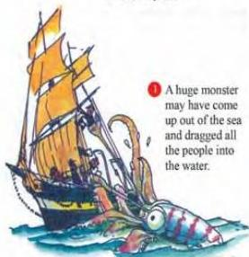
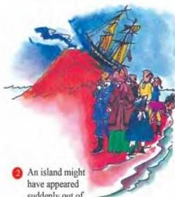
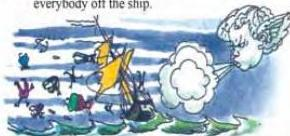
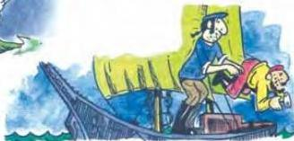
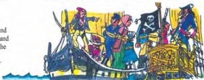

5.7

## What could have happened?

Since the *Mary Celeste* was found, many people have tried to explain the mystery. Do you believe any of the explanations? If not, why not?

1 A huge monster may have come up out of the sea and dragged all the people into the water.

2 An island might have appeared suddenly out of the ocean and everybody got off the ship to walk on the new land. But then, just as suddenly, the island must have sunk back into the sea and everybody must have drowned.

3 A hurricane could have blown everybody off the ship.

4 The passengers and crew might have caught a terrible disease and decided to drown themselves.

5 Pirates may have attacked the ship and taken all the crew and passengers. Then the pirates could have sold them as slave

38

Now do activities A and C in the Workbook.