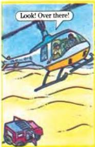
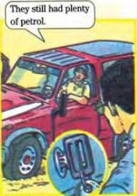
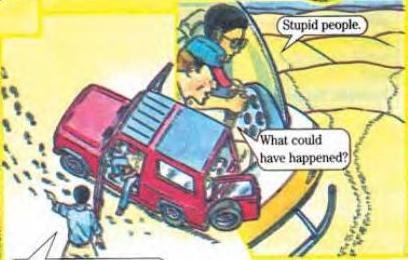

5.11 5.12

# Tracks in the sand

Read the short introduction and look at the pictures. They tell the beginning of a story. Workbook activities A to C in lessons 5.11 and 5.12 will help you write the story 'Tracks in the Sand'.

Hamad Faisal and Tim Brook work for the National Oil Company. They often fly across the desert to the oil-fields. One afternoon...

Hamad Faisal and Tim Brook

The nearest road is 25 kilometres away! Come on!

40