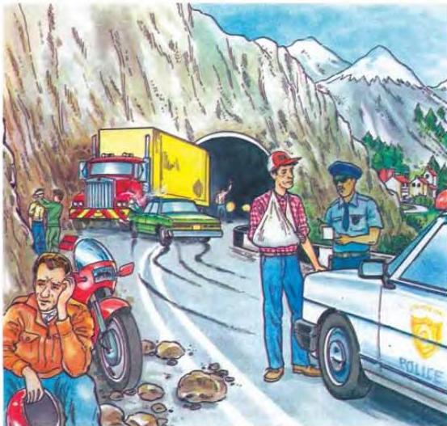

6.2

## A lucky escape

Look at the picture. Then describe it using words that you collected in your Workbook in the last lesson and the language below. Start with the things furthest away.

In the distance, you can see ...
Nearer us, there's ...
In the foreground, there are ...

Now think about the accident. First choose and read out the correct headline from page 41. Then discuss these questions:

- What must have/may have happened?
- What is happening now?
- What is probably going to happen next?

Now do activities A and D in the Workbook.

42