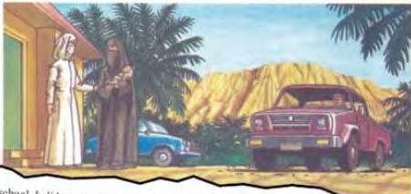

## Accident at Jebel Kebir

6.3

Look at the picture. Guess what has happened and what is happening now. Then read the text to find out if you were right.

In the school holidays Anwar always helped his father Kassim with the farm. One morning, they were checking the line of beehives below the high, broken rocks of Jebel Kebir. The had nearly finished when they heard a loud crash above them. They looked up. A large rock was starting to roll. 'Look out!' shouted Kassim. Other rocks were starting to move too. 'Get back!' The heavy rocks were rolling and bouncing down from the mountain, and the ground shook. Frightened by the noise, hundreds and thousands of bees rose from the hives. 'Run, Anwar!'

But Anwar tripped and fell to the shaking ground. His hat and the thin material covering his face fell off. The noise of the rocks - and now the bees - was terrible. A large rock bounced and rolled past him, just missing his head. Kassim turned and saw what was happening. His son might be killed! He started to run back, but the angry bees were there first. In a second, hundreds of them were covering. Anwar's hands, face and neck. Kassim rushed to his son, hitting out at the bees and trying to push them away. He half pulled and half carried Anwar to safety.

***

As Kassim raced back to the village in his pick-up, he kept looking at his son beside him. Anwar groaned. The bee stings had made his face and hands look huge, and he was in a lot of pain.

Ten long minutes later, the pick-up screamed to a stop outside the clinic. District Nurse Salwa Mafouz was there. She was saying goodbye to her last patients and was getting ready to leave. Kassim jumped out, ran round to the other door and pulled his son out. Anwar's eyes were closed and he was almost unconscious. The two of them carried Anwar into the clinic, and Salwa started work immediately. 'He's been stung hundreds of times,' she said. 'I've never seen anything like it!' Then she held his wrist to check his pulse. She could only just feel it. 'Quick!' she said. 'We must get him to hospital in Hajjah.' They put Anwar on the back seat of her car, and she drove away at high speed. Kassim followed in the pick-up.

### Answer these questions.

1. What turned an ordinary job into a terrifying incident?
2. What turned the incident into a major medical emergency?

Now do activities A and B in the Workbook.

43