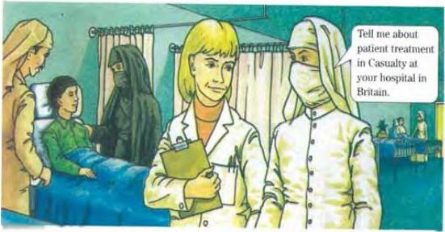

# How a hospital works

6.6

You wrote about the process of saving Anwar in the Past simple. However many processes always happen in the same way. We can then write about them in the Present simple.

Read what Dr Shakir's visitor says. Do you think the process is the same in a casualty unit at a big hospital in Yemen?

Well, the process probably isn't very different from what you do here. We have a two-track system. We put people with really bad injuries in the 'fast track'. They're patients who come in by ambulance from a bad car crash, for example, or people like Anwar. They're the highest priorities, of course, and they get immediate treatment.

But most people aren't so badly injured. And we put patients like these through a longer process. In fact, if there has been a bad road accident, for example, they may just have to wait because all the doctors are busy with the high-priority patients.

So what happens is this. Receptionist register the personal details of the slow-track patients. From there, patients go and wait to see the reception nurse, who quickly examines each patient and gives them a priority - red for bad injuries and also for young children and old people, and blue for people with less serious injuries. She adds her notes to the registration form and sends it through to the team of doctors. Patients then usually have to wait again before their turn comes to see a doctor. The doctors call patients into the examination rooms and examine them carefully. The doctors may give all the treatment that is necessary. But they may send a patient for treatment by another unit - the X-ray unit for a broken bone, for example.

Read the underlined parts again. These are important steps in the process of treatment. Find and underlined three more steps Then do activity A in the Workbook.

45

SOM