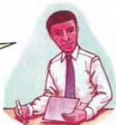
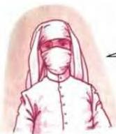
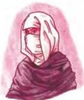

6.7

## Working in public service

Read about three people who work in public service. Which one do you already know? What is her job? What words and information help you?

I grew up here when the war was terrible. I hated it. The city centre was destroyed. And that was when I decided I had to help make this place the Arab World's most beautiful city and most important business centre again. That's what I've been doing since I finished college, and we've done a lot. I really love helping to make life better for everyone here.

Even when I was young, I liked trying to help people with their problems, so my job is just right for me. I've been doing it now for three very busy years. There's a lot to do here. It's the main entry port for Hajjis from all over the Moslem World, so there are many nationalities and lots of people with cultural and social problems.

Before, there was no health care in the area. I've been working here for eight years now, and things have really improved. I visit several villages each week, and I deal with more major problems go to hospital in Hajjah. I also do a lot of health education. I feel good that we've reduced death and disease so much.

Read about the other two people. What jobs do they do? Choose from the jobs in the box. As you read, think about the words and information that help you.

customs officer district nurse English teacher, heart surgeon paramedic planning officer social worker radiographer

Discuss what all these people like about their work.

Now do activities A, B and C in the Workbook.

46

--