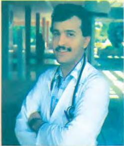

# Huge changes in Libyan health care

6.8 6.9

Read the title of the page, the title of the magazine article and the introduction to the article. What do you think the article will be about?

Now read the text. What important things happened in Dr Badawi's life in 1960, 1967, 1969, 1973, and 1987?

# A LONG LIFE IN MEDICINE

Dr Suleiman Badawi, Senior Surgeon at Tripoli Central Hospital since 1987, looks back on his life in the Libyan Republic.

I remember the day in 1960 when I decided to become a doctor. I was 16, and two months earlier a good friend of mine, Sadiq, had died of tuberculosis. Now it seemed my younger sister, Fareeda, was going to die too. She had measles, and her temperature was very high. We knew measles was easy to cure - with proper medical care. But the nearest doctor was 200 kilometres away. I

felt very angry as we sat with Fareeda. 'Why should good people like Sadiq and Fareeda die? I asked myself. Disease and death were common in our little country town, where there were no medical facilities at all.

Thanks be to Allah, Fareeda's temperature began to go down the next day, and she slowly got better. However, I was still angry. 'This can't go on', I thought. 'There should be medical help for everyone, not just for a few people in the cities.' That was the day my future was decided.

At that time, there were no training facilities for doctors in Libya, and I had to go to Cairo. Two years after qualifying, in 1969, when I was completing further training in a large hospital in Alexandria, news of the new Republic came.

The Republic put people at the centre of society. And for a better society, everybody needed good health care. This was exactly what I believed! The situation soon began to improve and now we have more doctors for every 1,000 patients than almost anywhere in the world.

In the old days, trachoma was a terrible disease that made many people blind. As an eye surgeon, I was extremely interested in this area of medicine. It was a great moment in my life when I was asked to run the new Trachoma Centre in Benghazi in 1973.

It is wonderful that we now have good health care, with trained medical staff in health centres and hospitals everywhere. Through hard work, we have at last stopped the terrible diseases of yesterday - malaria, tuberculosis and trachoma. I am only sorry that Sadiq cannot be here to see all these changes.

Imagine that you have been told to chose one of the jobs that you have read about in the last two lessons. Which would it be, and why? Which would you not want to do?

Now do activities A to D in the Workbook.

47

[LOGO]