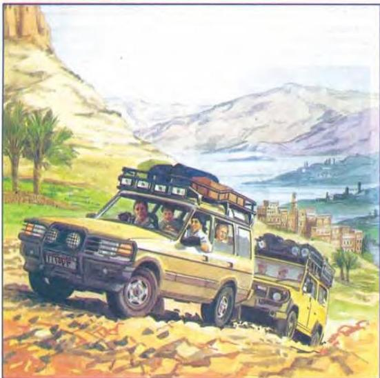

6.10

## Discovering Yemen

### Talk about the picture.

Describe what you can see - first the two four-wheel-drives in the foreground and then the things further away in the distance.

Now say what you think about the picture. Where must it have been taken? Who do you think the people in the four-wheel-drives are? Where might they be going? Give reasons.

Now do activities A to B in the Workbook.

48

