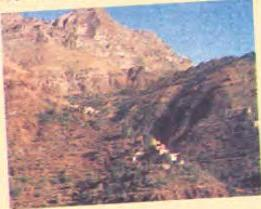

# Tourism and the future

6.11 6.12

Look at the article below. What sort of magazine do you think it is from? Look at the headline and pictures. How does it seem connected with the last lesson?

Read the article and do activity 6.11 A in the Workbook.

# DISCOVERING YEMEN

By Jim Robinson

A majestic view of the mountains as we travelled north-west from Sana'a.

# Day 3

We left Sana'a early and travelled up into the magnificent mountains to the north-west of the capital. During the long trip, I became friends with Faysal Hatem Al Qadhi, the driver of the four-wheel-drive. I found out to my surprise that he was the

owner of the little travel company that was taking us on this trip. As we talked, I started seeing him as the face of the future of Yemen. A typical Yemeni, Faysal is friendly, polite and kind, and full of energy and ambition for the future.

What Faysal told me about his business showed this clearly. Having always been interested in tourism, he started his company fifteen months ago with just one old four-wheel-drive. Now he has two new vehicles and the company is growing fast.

His ambition is to have eight or ten 4WDs two years from now and to take visitors all over Yemen. Looking a few years into the future, Faysal hopes he will have a wife and children. He doesn't want to be very rich, but he does hope to own a house and to give his family the things they need.

Does he think tourism will change Yemen? Yes, but he believes most of the changes will be good ones. For example, there will be better roads and hotels, and people will have more money. However, he doesn't feel that people will start to think about money and nothing else. He is certain that the traditional way of life is strong enough to prevent that.

Re-read the article and complete activities 6.11B, and C and D in the Workbook.

You are now going to write about yourself, what you are interested in, what you hope for and what you want to do in the future. Look at the article and find language that will help you. Underline expressions that show:

1 what Faysal is interested in
2 his ambition
3 his hopes
4 what he wants / does not want
5 what he believes

Follow the instructions in activity 6.12 A in the Workbook to complete the writing activity.

49

M