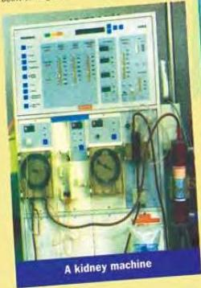

ARTS 1

# A difficult choice?

Olivia Lee was travelling in a taxi when the taxi-driver started talking to her. He told her that he had 11-year-old twin daughters. One of them was very ill with a kidney disease.

'Why don't you give her one of your kidneys?' asked Olivia, 'or her sister could

give her one.'

'What would you know about it?' asked the taxi-driver.

Olivia told him that she was a kidney donor; she had given one of her kidneys to her brother. The taxi-driver stopped the taxi to hear her story.

Olivia had not seen her brother, Michael, for a long time. She was shocked when she saw him. He had always been athletic, lively and good fun. Now he was thin, tired and ill. He had a kidney infection that could kill him. He had two choices. He could wait for somebody with healthy kidneys to die, hope that they matched his, and have a kidney transplant. His second choice was to spend the rest of his life connected to a machine that would do the job of his kidneys for him.

Olivia immediately decided to give Michael one of her kidneys. She knew that, although people normally have two kidneys, some people are born with only one and live normal lives.

Olivia told the taxi-driver that when she arrived at the hospital, the doctor had explained that there is always some risk in an operation, but the risk is small for a healthy person. However, the operation would be more serious for Olivia than for her brother. He would have to cut deeply into Olivia's body to remove her kidney without damaging it. The scar from the cut would be 30 centimetres long. She also learned that she would be in hospital for a week to ten days and then have to rest for three to four weeks.

Nevertheless, the operation was successful. Michael is now leading a normal, healthy life. Olivia has a scar to

remind her of the operation, but she does not feel any different. Her advice to the taxi-driver was this: 'If you are close to somebody, don't hold back. It's worth the pain and the small risk.'

That may be so, but it is also true that Olivia gave her brother the greatest gift she could have given him – life.

(This story is true, but the names have been changed.)

# Discussion

* From what you now know, would you donate one of your kidneys to a brother or sister?

51