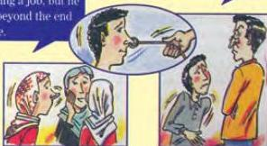

ARTS 2

# Proverbs and idioms

'Half a loaf is better than no bread at all' and 'look down your nose at something.' Which is a proverb and which is an idiom? Being able to answer this is a sign that you know - or are on

the way to knowing - how English works. Of the two, idioms are the most widely used. Choosing the right idiom and using it at the right time is a sign of real progress in English.

# Proverbs

A proverb is a sentence that expresses a truth or moral lesson. There are proverbs in most languages and some are very old.

Match these English proverbs with the explanations.

Proverbs

1 Half a loaf is better than no bread at all.
2 One man's meat is another man's poison.
3 Actions speak louder than words.
4 No man can serve two masters.
5 One good turn deserves another.

Explanations

a A person cannot serve two opposing groups or ideas.
b Having something is better than having nothing.
c A person's actions are more important than what he or she says.
d If someone does something kind for you, you should return this by doing something just as kind.
e What is good for one person may not be good for anyone else.

What about these proverbs?

Many hands make light work. Too many cooks spoil the broth.

They have the opposite meaning. Broth, by the way, is a kind of soup.

Do you have any pairs of proverbs in Arabic that have opposite meanings?

# Idioms

Idioms are very common in English and they can be very difficult for learners to understand because the general meaning is different from the meanings of the words used. Like language, idioms change with time, and some idioms that were widely used ten years ago, can sound old-fashioned today.

Sometimes the same word is used in different idioms. Read these idioms and match them to the pictures.

lead someone by the nose

pay through the nose

poke your nose into something

look down your nose at something

can't see beyond the end of your nose

Ahmed should be thinking about getting a job, but he can't see beyond the end of his nose.

Be careful of those chairs! I paid through the nose for them.

Can you think of any Arabic idioms that use the same words?

52