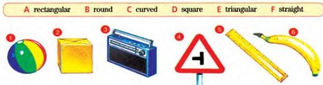
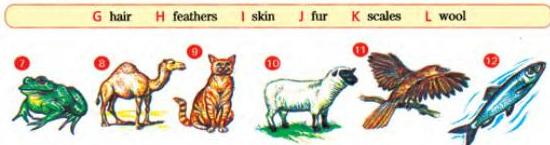
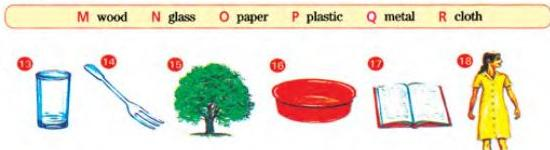

UNIT 1 DESCRIBING THINGS

1.1

# Shapes, coverings and materials

Here are some words to describe things. Match them with the pictures and write your answers in Workbook activity A.

Shapes

Animal coverings

Made of

Can you describe other things using any of the words above?
Make sentences like these:

An orange is around.
A dog has hair.
A window is made of glass.

Now do activity B in the Workbook.

1