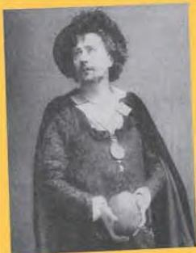

ARTS 4

## A famous play by Shakespeare

The story of a play is called the plot. The people in the play are called the characters. William Shakespeare wrote 37 plays - tragedies, comedies and histories. Which kind is this play?

### *Hamlet*

This play is about murder and revenge. Hamlet is Prince of Denmark. His father, the king, dies. A short time later, Gertrude, Hamlet's mother, marries again. She marries Claudius, Hamlet's uncle, who becomes the new king. Hamlet is angry at his quick marriage. Then the ghost of the old king appears to Hamlet and tells him that Claudius killed him by poison. He asks his son to revenge his murder. Form that time on, Hamlet can think of only one thing - killing Claudius.

Polonius is an adviser to the king. He has a daughter, Ophelia. She loves Hamlet, but she finds that he has changed. She does not know why this has happened, but she believes that she has lost his love. Then, by accident, Hamlet kills Polonius. This is too much for Ophelia. She goes mad, falls into a river and drowns.

Laertes, Ophelia's brother, blames Hamlet for the deaths of his father and his sister. He decides to kill Hamlet. He gets help from Claudius, who also wants Hamlet dead. A sword fight is arranged between Hamlet and Laertes. It is to be an exhibition only, with the points of the swords covered so that nobody can get hurt. However, Laertes leaves his sword uncovered and puts poison on the point. The fight begins, with Gertrude and

Claudius watching. Claudius has prepared a drink for Hamlet with poison in it in case Laertes fails. When Laertes cuts Hamlet with his sword, Hamlet is surprised. He manages to knock Laertes' sword from his hand and exchange swords. Then he stabs Laertes, who falls dying. In the meantime, before Claudius can stop her, Gertrude takes some of Hamlet's drink and dies. The dying Laertes tells Hamlet everything. Then Hamlet turns and kills Claudius. Soon after, Hamlet dies from the poisoned sword.

#### Discussion

- Was Hamlet good or bad?

54