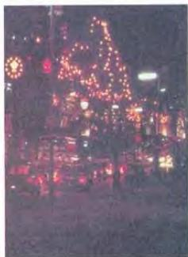

ARTS 5

## Telford Hall Episode 2

The weeks passed. Winter was approaching and the days were getting shorter. One day, Ahmed heard the other students talking about going home for Christmas. He realized that he would soon be by himself for three weeks. Suddenly he missed home: the warm evenings walking on the beach, camping in the desert, his friends ... He wondered what his mother was cooking for the evening meal that night. He was lying on his bed looking at the ceiling when there was a knock on the door. It was Bob.

'Hi, Ahmed. Listen,' he began. 'I've just been on the phone to my parents and they asked me to invite you to spend Christmas with us. Would you like to come?'

'Dear Khaled,' Ahmed began. He was sitting in the lounge at Telford Hall, writing a letter to his brother, Khaled. Ahmed wanted to tell Khaled all about Christmas, Bob's parents lived near Liverpool and had taken him to lots of places in the city and the surrounding countryside. On Christmas Day, Bob's older sister, Jenny, had come with her husband, Graham, and their two children. It had been strange to hear the children call Bob 'Uncle.'

One morning, Ahmed said to Bob, 'You're eating in my room this evening.'

'Why?' asked Bob.

Ahmed explained about *Ramadan*. He explained that every Moslem fasted dawn to dusk during that month.

'It must be difficult,' said Bob.

'It sometimes is,' answered Ahmed, 'but it's our duty. And we look forward to *Eid al-Fitr*.' 'What's that?' asked Bob. Another explanation followed.

'Well, it's tonight. I've invited Mick, Jerry and Derek and a couple of others. You can come, can't you?'

'Try to keep me away!' Bob exclaimed.

'Where do I sit?' asked Derek as he came into Ahmed's room.

'Anywhere,' said Ahmed.

He had pushed all the furniture to one end

*Christmas lights in Norton*

of his room and everybody was sitting on the floor around a brass tray his parents had sent him. It was now piled high with meat and rice. On Ahmed's desk there were two dishes of sweet pastry made with honey and nuts.

'Who made all this?' asked Bob.

Ahmed explained that he had given the recipes and spices to the cooks in the kitchen of Telford Hall and spent the afternoon helping them. He played some cassettes from home and later passed around the dishes of sweet pastry. Earlier in the day, he had phoned his family to wish them a good *Eid* and he was a little sad that he was not at home. But Ahmed felt good celebrating *Eid al-Fitr* with his new friends.

At the end of the first year, town planning students had to do six three-hour exam papers, one every morning and afternoon for three days. Ahmed had been studying hard and he decided to relax before the exams and take the weekend off. He wanted to visit Stratford-upon-Avon. Bob had agreed to go with him.

55

--