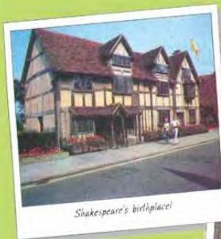
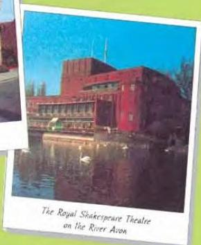

ARTS 5

Shakespeare's birthplace!

The next Saturday morning, they were walking around this famous town, which is about three hours' drive from Norton. They stopped in front of one of the many old houses still standing in Stratford.

'Here we are,' said Bob.

'You mean this is the actual house?' asked Ahmed, surprised.

'Yes,' answered Bob. 'This is the actual house where Shakespeare was born on April 23rd, 1564.'

Ahmed could not believe it. He knew that Shakespeare was born in Stratford, but he had never imagined that the actual house would still be there.

'Let's go in,' suggested Bob.

All the furniture in the house was from the 16th century. In the living room there were heavy wooden chairs and cupboards. Even the cooking equipment in the kitchen was from that period. Upstairs they walked through the room where Shakespeare was born and saw the desk where he studied as a schoolboy. Ahmed was fascinated.

They stayed the night at the local Youth Hostel and spent the next morning rowing on the River Avon, which gives the town part of its name.

'What's that?' asked Ahmed, pointing to a huge brick building by the side of the river.

The Royal Shakespeare Theatre on the River Avon

'The Royal Shakespeare Theatre,' answered Bob. 'They perform Shakespeare's plays there. They do three of four different ones every year.'

'How many plays did he write?' asked Ahmed.

'Thirty-seven,' said Bob.

Before they left Stratford, Ahmed wanted to buy some souvenirs. In the tourist shops, you could buy Shakespeare teapots, Shakespeare dolls, and even Shakespeare toothbrushes. Everything had 'Shakespeare' on it. Ahmed bought a book of photographs of the town. He also bought some copies of Shakespeare's plays and a special mirror. Shakespeare's beard, eyebrows and hair were painted on the mirror so that when you looked at yourself, you looked like Shakespeare.

'I'll give it Khaled,' said Ahmed. 'I think he will like it.'

# Discussion

- Explain Eid Al-Fitr in English.

56