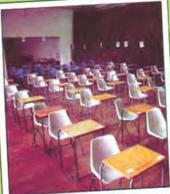

ARTS 7

# Telford Hall Episode 3

On the morning of the final examinations, the sun was shining brightly.

'Lovely day,' said Ahmed.

'It always is when there's an examination,' said Bob.

He and Ahmed were walking through the college gardens on their way to the main hall, where the examinations were held. There was a crowd of students waiting outside. At 9.45 exactly, the doors opened and the students poured into the hall, where rows of desks stood waiting. On each desk, there was a name card and a piece of paper, face down: the examination paper! Ahmed found his place.

A large exam hall

A lecturer Ahmed had never seen was supervising the examination.

'Attention everyone,' he said slowly and loudly. 'As you know, the examination lasts for three hours. When I say "begin" turn over your papers and start. Good luck. Begin!'

By the time he finished the last paper on Friday afternoon, Ahmed's arm ached from writing so much, but he did not mind. He was just happy that the exams were over. The examination results would come out the following week and Ahmed had decided to stay

in Norton until then.

'Are you staying in Norton or going home?' he asked Bob.

'Oh, I almost forgot,' said Bob. 'My parents phoned last night. They would like you to come home with me and stay with the family for a few days.'

'I'd love to,' said Ahmed. 'We'll take the taxi.'

On the following Sunday morning, Ahmed, Bob and his mother went for a walk along the beach. Bob's father stayed at home to cook lunch.

'He always cooks Sunday lunch,' she explained, 'roast meat and vegetables - and he doesn't like being disturbed.'

Next to the beach there were high sand dunes.

'They remind me of home,' said Ahmed.

When they got back to the house, they were met by a wonderful smell coming from the kitchen.

'Smells delicious,' said Ahmed.

It tasted delicious as well: perfectly cooked roast beef with four different vegetables and a special sauce.

After lunch, everybody helped with the washing up and it was soon finished.

'Many hands make light work,' said Bob's mother.

For the rest of the afternoon, they sat and talked or read the thick Sunday newspaper. Bob's sister and her family called in to say 'hello'. When they had gone, Ahmed, Bob and his father played a word game, like a crossword puzzle. In the evening, they all watched an old film on television. Later, just before he fell asleep, Ahmed thought about how much he had enjoyed spending a quite Sunday in Bob's home. It made him miss his own family.

Bob and Ahmed arrived back in Norton on the day the examination results came out. The list of results was on a notice board in the main college building.

58

Teflon