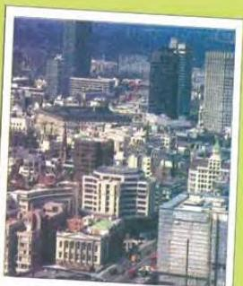

ARTS 7

'Our names, Ahmed: they're not on the list!' said Bob, worried.

'You're looking in the wrong place,' said another student. 'Look at the top of the list.'

Bob had been looking for the two names among the B and C grades, but under grade A were the names Robert Wilson and Ahmed Hassan Al-Hadrami.

'That will make your father happy,' said Bob. 'When are you going home, by the way?'

'The day after tomorrow,' replied Ahmed.

'Now, Bob, you will take care of the taxi while I'm away, won't you?' said Ahmed.

'Of course,' said Bob. 'Don't worry about a thing.'

They were standing on the platform of Norton Central station, waiting for the London train. It was raining.

'It was raining when I arrived,' said Ahmed.

'At least the rain is warmer now,' said Bob.

The train arrived. Ahmed got in, stood by the door and opened the window.

Telford Hall,
Norton,
Friday.

Dear Mr and Mrs Wilson,

Thank you very much for having me to stay for the past few days. I had a wonderful time and you really made me feel like one of the family.

I hope one day that I will be able to repay your kindness and hospitality.

Thank you again.

Best wishes,

Ahmed

Looking down on London from the plane

'See you in October ...' he shouted through the window as the train moved out of the station.

'Have a good journey ...' shouted Bob, waving at his disappearing friend.

Ahmed sat down and looked out at the countryside moving past. Nine months ago, it had seemed strange to him, but now he knew it so well. He started thinking about the places he had been and the friends he had made. There were so many. The train stopped. He was in Euston station. Four hours later, he was sitting in the plane looking out over London. He could see the city clearly. Then the plane went up through the clouds Ten hours later, he would be home.

# Discussion

- Does your family spend Fridays in a traditional way?
- Compare your Fridays with English Saturdays.

59