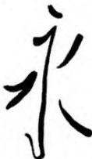
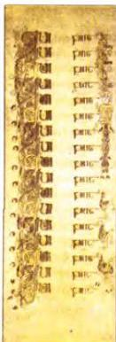
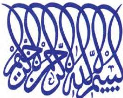

ARTS 8

# Calligraphy

The word 'calligraphy' comes from Greek. It means 'beautiful writing'. It is the art of fine handwriting and has been practised in many countries for centuries. In the Far East, a pointed brush is used. In Western and Islamic cultures, a pen is the calligrapher's tool.

Calligraphy in China has a history going back thousands of years. There was a strong connection between painting and calligraphy because they used similar methods and materials. However, calligraphers were seen as scholars, while painters were seen as ordinary workers. It was not until the 5th century that they were treated as equals.

In Western cultures, calligraphy was based on the Roman letters. Different styles were developed from these basic shapes. Calligraphers were often religious men and the most beautiful examples of Western calligraphy are usually found in religious books. The pages are made beautiful by the shapes of the letters, the pictures added as decorations, and by the right colours used.

Calligraphy among the followers of Islam was seen as the greatest of the arts, because of the importance of the writing of the Holy Koran. Therefore, many calligraphers concentrated the name of God.

As Islam spread, so did calligraphy. The art grew and developed and two main styles appeared. *Kufic*, an angular style for carving in stone, appeared in the 7th century. By the 10th century, *Nashki*, a more flowing style with rounded letters, appeared and *Kufic* had almost disappeared. New forms of calligraphy also appeared in art and architecture. Artists twisted words into circles, squares and other shapes, small enough to fit on a plane or large enough to decorate the wall of a mosque. Birds, fruit, animals and even the shapes of mosques, ships and the Islamic Star and Crescent became part of the calligrapher's art.

A number of young artists today are interested in traditional calligraphy. A good example is a piece of modern calligraphy in the shape of the Hand of Fatimah. It was designed as a greeting card by the Lebanese artist Mouna Bassili Sehnaouri some years ago. It reads *Ma sha 'Allah* - 'As God wills'.

# Discussion

- • Is calligraphy important today?
- • Should writing be easy to read or beautiful?

60