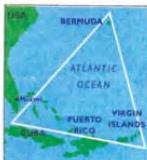
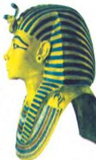

ARTS 10

# Strange happenings

# The Bermuda Triangle

The Bermuda Triangle is a name given to an area of the Atlantic Ocean between the islands of Bermuda and Puerto Rico and the coast of the State of Florida in the USA. It is famous because many ships and planes have disappeared there.

Perhaps the biggest mystery is the loss of five US Navy planes in 1945. At 2pm on December 5th they took off from Fort Lauderdale to fly over the Bermuda

Triangle. The weather was perfect. Soon afterwards the leader of the flight sent this message on the radio: 'We are off course ... we cannot see land ... everything is wrong and strange ... the ocean doesn't look the way it should ...' And then silence. Another aircraft was sent to look for the missing planes, but it too was never seen again. In total, six planes and 27 men had disappeared.

Nobody has ever been able to explain this or any of the other disappearances. Over 150 ships and planes and more than 1,000 people have been lost in this part of the ocean.

# The curse of Tutankhamun

Tutankhamun was the king, or Pharaoh, of Egypt over 3,500 years ago. He died when he was only 10 years old and was buried in Luxor in southern Egypt. As was the custom in those days, his tomb, the room where his body lay, was filled with treasure and then closed in. In later years, robbers used to break into the Pharaoh's tombs to steal the treasure, but the tomb of Tutankhamun stayed hidden for centuries. Then in 1923 the British archaeologist, Carnarvon, found and broke into the tomb. Above the gold coffin of the boy king was a piece of writing, which Carnarvon translated. It read: 'Death will come to those

who disturb the sleep of the 'Pharaohs.'

Two months later, Carnarvon was dead. Doctors said that he had been bitten by a mosquito. Other members of his team died of mysterious illness soon afterwards : after six years, 12 of the people who had broken into the tomb were dead. Other deaths followed. In

1972, the treasure of Tutankhamun was flown to London by plane for an exhibition. For years later, the pilot of the plane died suddenly at the age of 40. At the time his wife said: 'It's the curse of Tutankhamun - the curse that killed him.

Tutankhamun

# Eryl's dream

The main industry of Aberfan, a small town in South Wales, used to be digging for coal. Coal dust and small pieces of coal could not be sold, so they were piled up in heaps, called slag heaps. They were like small, black mountains. There was a primary school in the town and, on the hill above the school, was a slag heap. Eryl Jones went to the primary school in Aberfan. One day she told her mother about a dream. She dreamed that she had gone to school, but the school was no longer there. 'Something black had come over it,' she said. Two days later the slag heap slid down the hill and covered the school. 144 schoolchildren and teachers died.

# Discussion

- Try to explain these three things.
- Can you think of any happenings like these?

62