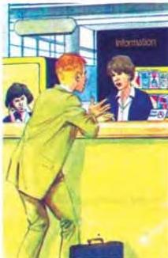

1.3

# Lost

**Listen to how the passenger speaks. How does he feel? Answer the questions in Workbook activity A. Listen and repeat the conversation.**

**Passenger:** Excuse me! Excuse me, miss!  
 **Clerk:** Can I help you, sir?  
 **Passenger:** Yes. I've just got off the plane from Paris, but my luggage hasn't arrived yet.  
 **Clerk:** Can you describe your luggage, sir?  
 **Passenger:** What am I going to do? No clothes! Nothing!  
 **Clerk:** Calm down, sir. There's no point in getting upset. Now, can you describe your luggage?  
 **Passenger:** Two suitcases.  
 **Clerk:** Are they the same size?  
 **Passenger:** No. One is bigger than the other.  
 **Clerk:** Are they the same colour?  
 **Passenger:** Well, they're both green, but the smaller one is a very light green.  
 **Clerk:** Ok. What shape are they?  
 **Passenger:** The larger one is rectangular. The smaller one is more square-looking.  
 **Clerk:** Now, don't worry, sir. Give me your luggage tags and we'll soon find them.

**Listen to how the girl speaks. How does she feel? Answer the question in Workbook activity C. Listen and repeat the conversation.**

**Girl:** Excuse me, officer. Can you help me, please? My name is June, and I've lost my sister, Kate.  
 **Officer:** Oh, dear! How old is she?  
 **Girl:** Ten. She's my twin sister. She's the same age as me.  
 **Officer:** And does she look the same as you?  
 **Girl:** No, not really. She's not as tall as me. And she's a little bit fatter. She eats a lot you see.  
 **Officer:** Is her hair the same colours as yours?  
 **Girl:** Yes, but mine isn't as long as hers. Hers is much longer.  
 **Officer:** What is she wearing?  
 **Girl:** The same as I am ... except her T-shirt is red.  
 **Officer:** And when did you last see her?  
 **Girl:** Oh. About half an hour ago.  
 **Officer:** All right. Don't worry. Come along with me and we'll soon find your sister.  
 **Girl:** Ok. Thank you.

**Take turns to describe similar objects or people.**

**Now do activities C and D in the Workbook.**

2