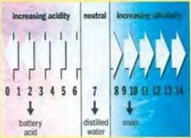
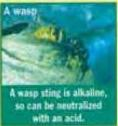
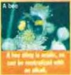
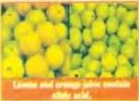
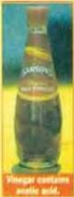
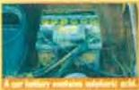

# SCIENCE 1

# Acids and alkalis

# Definitions

An acid has a sharp or sour taste. In fact the word acid comes from a Latin word that means sour. Acids corrode, or eat away at, metals and rocks. In chemistry a base is a substance that reacts with acids to produce salts. Bases that dissolve in water are called alkalis. The word alkali is from Arabic and means 'the ashes of a plant'. Acids and alkalis neutralize each other.

# Detecting and measuring acidity and alkalinity

# The litmus test

Litmus is a vegetable dye that is used to test the acidity of solutions. Litmus paper is soaked in this dye. It is green, but when put in an acid solution, it turns red. If the solution is alkaline, it turns blue.

# The pH scale

The strength of an acid or alkali is measured on the pH scale. This measures the concentration of hydrogen ions on a scale of 0 to 14. Low numbers show high acidity. On this scale,

soap has a pH value of 9.5 and distilled water a value of 7, which is called a neutral pH value. A pH meter, or an indicator such as litmus paper, is used to measure pH values.

# Acids and alkalis in everyday life

# Acid rain

The gases released by burning oil and coal and from car engines react with water in the atmosphere to produce rain that contains acid. This acid rain, with a pH value between 2.2 and 5, corrodes building materials, damages plants and pollutes lakes so that fish die.

# Soil

Plants will not grow in soil that is very acidic or very alkaline. Most plants prefer soil with an almost neutral pH value.

# Wasp and bee stings

# Common alkalis

Baking powder is bicarbonate of soda.
Its chemical formula is NaHCO3.
Lime is calcium hydroxide.
Its chemical formula is Ca(OH)2.

# Common acids

# Discussion

- What other common acids and alkalis do you know?

65