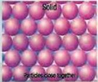
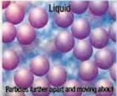
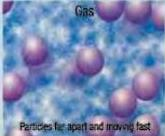
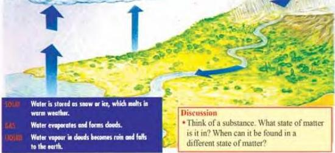

SCIENCE 2

## States of matter

In science, the word 'matter' is used to describe what things are made of. Matter comes in three different forms, called states: solid, liquid and gas.

Solids have a fixed shape that cannot easily be changed. Liquids have no fixed shape and can only be picked up in a container. Gases are even less easy to hold. They have to be kept in closed containers or they will escape into the air and spread very quickly. For example, you will soon be able to smell gas all over your house even if there is just a small leak in the gas container in your kitchen.

The kinetic theory states that matter is made up of particles that are always in motion – always moving. This theory helps us understand the different properties that matter has in its three states. In a solid, particles are packed together like balls in a box and can hardly move. Heating the solid gives the particles more energy. They move

more quickly, and are pushed apart. If there is enough heat, the particles have enough room to change places. This is when the solid becomes a liquid.

More heat makes the particles move even faster and travel further apart. They can then move freely to fill any space they are in. This third state of matter is called gas.

### The three states of water

Water is the only substance that is easy to find in the three states of solid, liquid and gas – as ice, water and water vapour or steam. The properties of water are very important for life on Earth.

66

S