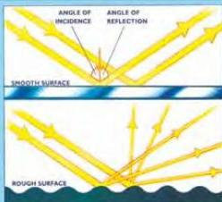
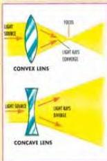
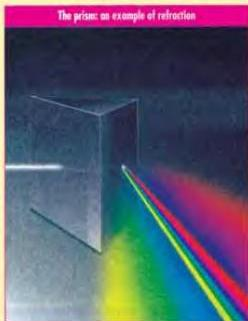

SCIENCE 3

# Light

# Definition

Light is a form of energy. Over the years, physicists have had different ideas about how light behaves. First some said it acts like a stream of particles. Later others observed that light acts like a wave that can travel through a vacuum, such as outer space. Most recently, the quantum theory has stated that it is a combination of both.

# Reflection

We see something when an object emits light, reflects light like a mirror, or changes light passing through it. We see most things by reflection. When you look at your desk, what you really see is light reflected from the desk. How much light is reflected depends on the surface that the light hits. A smooth white surface reflects more light than a rough black one. On a smooth surface, the angle at which light hits it is the same as the angle at which it is reflected. On a rough surface, these angles are different because the surface scatters the light.

# Refraction

Put a spoon at an angle in a glass of water. Stand back and look at it. The spoon appears to bend or split into two parts. This happens because light waves bend when they pass from one transparent medium to another. This effect is called refraction.

Refraction is made use of most commonly in *lenses*. Lenses are specially-shaped pieces of glass that refract light exactly. There two types of lenses.

A convex lens is thicker in the middle than at the edges and can make objects look larger. A concave lens is thinner in the middle than at the edges and makes objects look smaller.

# Discussion

- What is our main source of natural light?
- When does a raindrop act like a prism?
- When do we use lenses?

67