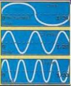
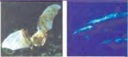

SCIENCE 4

# Sound

# SOUND WAVES

Sound travels as waves. Unlike light waves, sound waves need a substance, such as air, to travel through. Because sound waves cannot travel through a vacuum, there is no sound in outer space.

Sound is created by something vibrating. As the source of the sound vibrates - an *oud*

string, for example - the molecules in the air near the source are squeezed together. They, in turn, hit against the molecules next to them and are pulled back into place by the molecules behind them. In this way, sound waves move through the air.

# FREQUENCY

Sound range from very low to very high. What makes the pitch different is the frequency of the sound waves. Frequency is measured in hertz (Hz) - the number of waves per second. One hertz is equal to one wave per second. A person with very good hearing can hear sounds down to about 20 Hz and up to about 20 kilohertz (kHz), or 20,000 Hz.

Sound waves can be represented by graphs showing how the intensity, or strength, varies with time. These graphs represent sound of three frequencies. At a frequency of 20 Hz, 1 complete wave occurs in ½ second. At a frequency of 50 Hz, there are 2½ waves during the same time, and at 100 Hz there are 5.

# ULTRASONIC SOUND

Frequencies higher than those that can be heard by people are called ultrasonic, meaning 'beyond sound'. One of the special qualities of ultrasound is that it does not spread out nearly as much as ordinary sound, so it can be directed almost like a beam of light. In industry, it can be used to find invisible flaws in solid metals.

Ultrasonic sound can be heard by many animals. Bats and dolphins can produce and hear sounds of 120 kHz or more. Ultrasonic sound allows bats to 'see' in the dark and dolphins to find their way underwater.

# VOLUME

Volume, or loudness is measured in decibels (dB). The sound of people talking measures between 50 and 70 dB; the sound of a jet

plane taking off measures between 110 and 140 dB. Sounds of more than 120 dB cause pain and can lead to deafness.

# Discussion

How is ultrasound used in medicine?
What is the loudness sound you have heard?

68