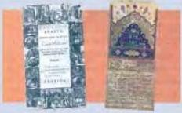
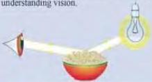

SCIENCE 5

# Arab scientists

Most people have heard of such scientists as Newton, Jenner, Einstein and Fleming. What people in the west often forget is their debt to their equally important predecessors: the Arab scientists. Isaac

Newton said, 'If I have seen further, it is by standing on the shoulders of giants.' He could have been talking about Ibn Sinna, Al-Khawarizmi, Ibn Al-Naifs, Ibn Al-Haytham or Jabir Ibn Hayyan.

Ibn Al-Naif's was a physician famous for discovering the blood's circulation system. He was born in Damascus in 607 and educated at the Medical College, Damascus. He made many important contributions to medical knowledge at that time. For example, he was the first person to explain how the lungs worked.

Al-Khawarizmi was a great mathematician, geographer and astronomer who died in 850. He invented the zero,

negative numbers, the decimal system and algebra. The term algorithm (used in computer programs and software) is named after a variation of his name, Al-Gorithmi.

Jabir Ibn Hayyan (721-776) was a pharmacist and a chemist who spent most of his life in Damascus. He is known as the father of molecular chemistry. Among his many inventions was a scale capable of weighing objects as light as 0.1587 of a gram. He also developed anti-rust coatings and fluorescent ink.

Ibn Sinna was born in 980 near Bukhara in what today is Iran. After finishing school, he taught himself logic, mathematics, science,

philosophy and medicine. He moved to Isfahan in 1022 and wrote his two most important books, the Book of Healing and the Canon of Medicine. These books were standard sources of medical knowledge for many centuries.

Perhaps the most famous of all the Arab scientists was Ibn Al-Haytham (died 1039). He greatly influenced later scientists like Sir Isaac Newton. Before Al-Haytham, people believed that vision was the result of a beam of light being emitted from the eyes. This did not explain why the size of an object depends upon its distance from the person looking at it. Ibn Al-Haytham proved that when we look at an object, the image occurs in the brain, not in the eyes. His research led him to think about how we recognize things. Al-Haytham showed that the brain is able to compare the new image with those stored in its memory. He realized this was the key to understanding vision.

# Discussion

- What other Arab scientists do you know?
- In what ways are they important?

69