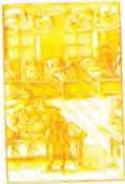
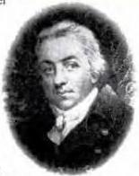
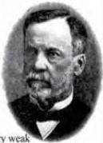

SCIENCE 6

# Vaccinations

Before the late 18th century, thousands of people died every year from such diseases as smallpox, typhoid and cholera. Doctors tried unsuccessfully to treat patients with these diseases while scientists struggled to find suitable cures. The big breakthrough came from an unexpected source: an unknown country doctor in England.

Dr Edward Jenner was

experimenting with ways of vaccinating against smallpox when he noticed that people working with cows did not suffer the disease. On May 14th, 1796, Jenner

successfully used the first vaccine against smallpox to immunize a patient. The word vaccine comes from the Latin cow, because Jenner's vaccine was developed from cowpox, a disease similar to smallpox but only found in cattle. Jenner's work with a cowpox vaccine was the first scientific attempt to control a disease by immunization.

A century later, the next significant

development was made by a French chemist, Dr Louis Pasteur. He developed Jenner's work and showed that diseases are spread by germs.

He also proved that vaccination using a very weak form of the disease could lead to immunity. Pasteur's breakthrough came in 1885 when he treated a boy who had been bitten by a rabid dog. Although Pasteur was successful, many other doctors were against the idea of vaccination. They felt that it was dangerous. They were soon proved wrong, and by the 20th century vaccines were commonplace.

AIDS is one of the most feared diseases in history. Millions of dollars are being spent on research into developing a vaccine against AIDS. Scientists think that AIDS developed from the blood of monkeys in Central Africa. The first cases of AIDS in humans were diagnosed in the early 1970s. Once AIDS had infected people, transmission around the world was rapid. Modern drugs have helped with some aspects of the illness, but they do not provide a cure. The only long-term hope is in the development of a vaccine. We need the modern-day equivalents of scientists like Jenner and Pasteur.

# Discussion

- Is it right to introduce a disease - even a weak form - into a person's body?

70