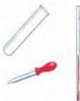
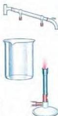
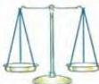

SCIENCE 7

# Experimental procedures

When you carry out a scientific experiment, every stage of the process should be recorded and written up as a full report to show your results and conclusions. Such reports help you think about what you did and point you towards possible solutions to problems.

Without a correctly written-up procedure, it is impossible to monitor scientific progress or exchange scientific information.

The starting point for scientific experiments is to answer a question, for example: *What happens when you heat wood/metal/plastic?* Experiments should always be measurable and show cause and effect.

Reports on experimental procedures should follow these (or similar) guidelines:

# Writing experiments

Your name: ...

Date: ...

TITLE: ...

QUESTION: The question should be detailed.

RESEARCH: This should be one or two sentences describing the information you know about the question. It should be the information on which you base your hypothesis.

HYPOTHESIS: This is an educated guess – a statement based on your previous research and experience that should answer the question.

MATERIALS: A list of **everything** needed for the experiment.

PROCEDURE: A step-by-step list of **numbered** instructions showing how to do the experiment. Each step should start on a new line and usually begin with a verb.

DATA: This is information collected during the experiment. It should include:

- all measurements and observations
- tables showing the data
- numerical data shown as graphs

SUMMARY: The summary is one or two sentences that explain the data.

CONCLUSION: This can have four parts :

- analyse the data
- see if your hypothesis was correct
- describe or explain your evidence
- identify experimental errors

# Discussion

- What experiments would you like to carry out?
- Why are experiments important for progress?

71