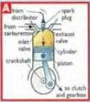
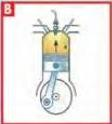
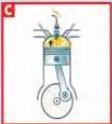
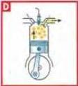

SCIENCE 8

# Internal combustion engine

When you turn the key in the ignition of a car, a lorry, a motor cycle or any other petrol-powered vehicle, you switch on the electrical circuit. Turn it again and you can start the engine. But what happens inside the engine? What is the sequence of events? These and other questions can be answered by explaining the sequence in one cylinder in step-by-step detail:

# Action

Turning the ignition key

Piston moves down A

Piston at bottom of stroke

Piston rises B

Spark plug provides ignition C

Mixture explodes

Piston rises again D

Piston at top of cylinder

This cycle is known as:

INDUCTION - COMPRESSION - IGNITION - EXHAUST

# Result

The starter motor turns the engine. The piston moves up and down.

Petrol and air are sucked in through the open inlet valve at the top of the cylinder. The air and petrol mixture is controlled by the carburettor.

The cylinder is full of air and petrol.

Air and petrol mixture is compressed.

At the top of the cylinder is the spark plug. This provides the electric spark that ignites the mixture.

The piston is forced down.

The burnt mixture is pushed out of the exhaust valve.

The inlet valve opens again and the cycle is repeated ...

# Discussion

- The internal combustion engine was invented at the end of the last century. We are now at the end of the 20th century. Is it time for a new source of power?

72