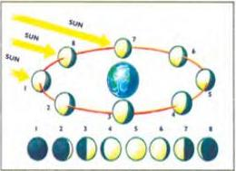
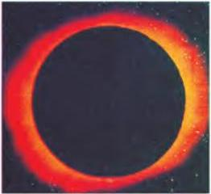

SCIENCE 9

# The Moon

The Moon is the only natural satellite of the Earth. It has a radius of 1,738 km. The Moon orbits the Earth. At the same time, the Earth moves around the Sun. Because of both movements, it takes the Moon just over 29 days to return to its original position. We can see the Moon because of light from the Sun, which always comes from the same direction. Because the position of the Moon changes in relation to the Earth, we see greater or lesser parts of the Moon as it travels around the Earth. What we see is known as the phases of the Moon. The most we ever see is one half of the Moon (Full Moon) and it is always the same half. This is because the Moon rotates, or prints, around its own axis as it moves through space.

The Moon's phases depend on what fraction of its sunlit hemisphere can be seen from Earth. As the Moon orbits Earth, it grows in size from New Moon (1) to Crescent (2), First quarter (3), Gibbons (4) and Full Moon (5). It then decreases in reverse order to Gibbons (6), Third quarter (7), Crescent (8), and back to New Moon.

# Eclipses

Almost every year, somewhere in the world the Sun disappears during daylight. This happens when the Moon passes between the Earth and the Sun, casting a shadow on the Earth and hiding all or part of the Sun from view. Such an event is called a solar eclipse. It may seem strange that a relatively small object like the Moon can hide a huge object like the Sun, which has a radius of more than 696,000 km. The answer lies in distance: the further away an object is, the smaller it looks. So although the Sun's diameter

is more than 400 times the diameter of the Moon, it can appear to be much the same size because it is between 367 and 419 times further from the Earth than the Moon is. When the Moon is closest to the Earth, it looks bigger than the Sun. This is when it can hide the Sun completely and cause a total eclipse.

What you see during an eclipse depends on where you are on Earth. You will see a total eclipse if you are in a place directly in line with the Sun and the Moon. In other places, you will see a partial eclipse with one edge of the Sun hidden by the Moon and the other edge visible.

The Moon itself can go into an eclipse, called a lunar eclipse. This happens when the Earth moves between the Sun and the Moon, casting its shadow on the Moon. At this time, the Moon almost disappears.

# Discussion

- In what way is the Moon important in daily life?

73

--