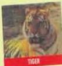
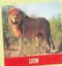
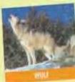
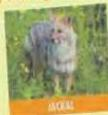
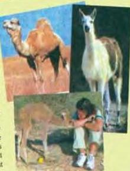
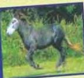

## An unusual animal

1.4

Look at the pictures and the title of the magazine article.
What do you think the article is about? What or who is Rama?

# Rama - the cama

## The cat family

## The dog family

Animals are divided into families. The house-cat is of the same family as its much bigger cousins, the lions of Africa and the tigers of India. The dog, the wolf and the jackal are part of the dog family. If animals are part of the same family, it is sometimes possible to crossbreed them to make a new animal. This was done several years ago when a lion was crossbred with a tiger, giving us a new animal called a 'liger'. Now, it has been done again. The new animal is called a 'cama', and has been given the name Rama.

Rama the cama was born in Dubai in January, 1998. It is a cross between a male camel and a female llama. Although they are from the same family of animals, they are very different. Camels live mainly in hot countries like Arabia, whereas llamas live in mountainous parts of South America where it gets very, very cold. Because of the intense cold at heights of 8,000 metres, llamas have coats of long, heavy wool.

So what does Rama look like? Unlike its father, it has no hump on its back. Like its father, it has the short ears and the long tail of the camel. It is bigger than a llama but not as big as a camel. However, the wool coat of the llama, which is very valuable, unlike the hair coat of the camel, which has little value.

The most
well-known
crossbreed

**Read the article. Then answer these questions.**

Is it possible to crossbreed a cat and a dog?

Why would camas like Rama find it hard to live in the wild in Arabia?

Is it right to crossbreed animals to make new animals? What do you think?

**Now do activities A and B in the Workbook.**

3