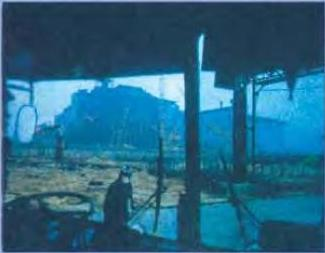

SCIENCE 10

# Radioactivity

The power station at Chernobyl, the site of the world's worst nuclear accident

Until April 1986, few people outside the Ukraine in Eastern Europe had heard of the town of Chernobyl. Then the nuclear power station there exploded. Clouds of radioactive dust spread over Eastern and Northern Europe. 250 people were killed and thousands of square kilometres were polluted. Even in Britain, more than 2,000 km away, animals were affected by the radioactive dust that fell from the sky.

# The discovery of radiation

The word radioactivity describes the changes that take place in the nucleus, or centre, of certain materials. When radioactivity occurs, rays are sent out. They were discovered in 1896, when a French chemist, Henri Becequerel, noticed that the metal uranium gave out rays that passed through other materials and affected photographic plates. He called these rays radiation.

# Effects

At that time, nobody knew about the effects of radiation on animal and plant cells. A small amount of radiation can cause cancer; long exposure to a large amount can result in death. Radiation caused the deaths of some of the early scientists working with it.

# Uses

Radiation can be used safely in many ways. One use is to find the age of dead plant and animal matter by measuring how much radiation it gives out. For example, the radiation from the bones of a dead animal can tell us when it died. Another use of radiation is to preserve food, because radiation can

destroy bacteria. Radiation is also used in medicine - in X-rays, for example.

# Nuclear power

The most important use of radioactivity is in nuclear power stations. There, electricity is generated in nuclear reactors using a radioactive process called nuclear fission. The nucleus of a Uranium-235 atom is split, or broken open. This causes the nucleus of another atom to split, then another, and so on in a chain reaction. Every time a nucleus is split, energy is released and heat is created. The heat is used to make steam, which drives the machines that generate electricity.

Nuclear power has two main advantages. First, there is enough uranium in the world to supply nuclear power stations for many hundreds of years. Secondly, nuclear power stations do not produce harmful gases. However, the accident at Chernobyl reminded the world of the dangers of radioactivity.

# Discussion

- Do you think nuclear power will ever replace oil?

74

--